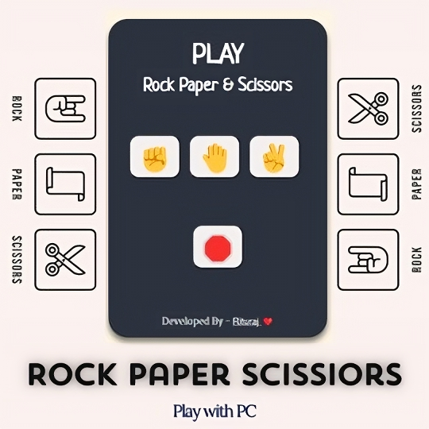

 

  

- 🌱 I’m currently learning **Full Stack Web Development**.

- 📫 How to reach me - **riturajdey01@gmail.com**

<h3 align="left">Connect with me:</h3>

<h3 align="left">Languages and Tools:</h3>

            

<h3 align="left">Projects Built:</h3>

    
    
    
    
    

